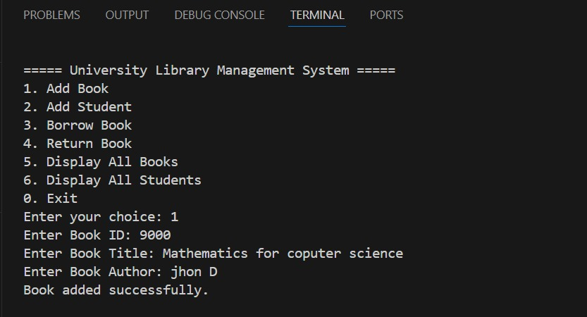
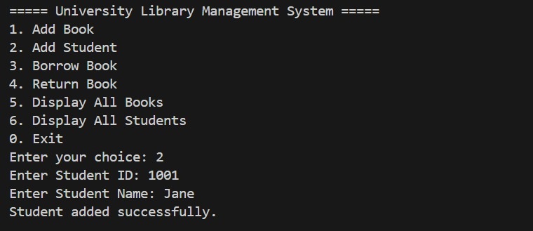
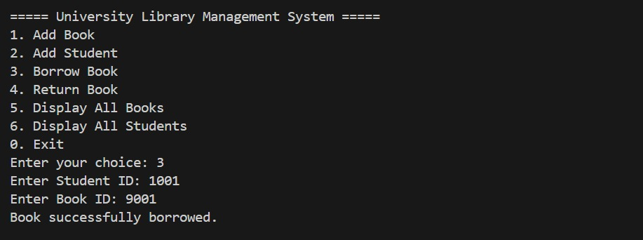
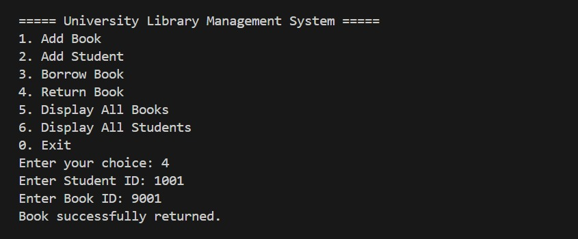
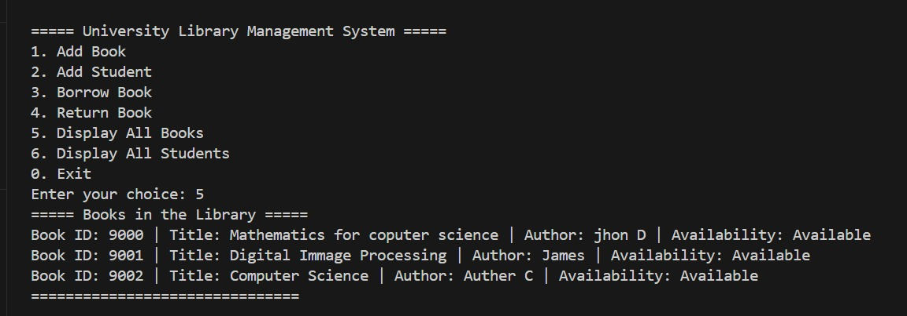

# University-Library-Management-System
# [Academic Project]

University Library Management System in C - A console-based application for managing library operations including book cataloging, student registration, and book borrowing/returning. The system tracks book availability and student borrowing history with simple data structures and user-friendly menus


This C program implements a simple University Library Management System that allows for:
- Adding books to the library catalog
- Registering students in the system
- Borrowing and returning books
- Tracking which books students have borrowed
- Viewing all books and student information
- The system maintains records of books (including title, author, and availability status) and students (including their borrowed books). It provides a console-based menu interface for all operations.

## Features
- Book Management:
    - Add new books to the library
    - Track book availability
    - View all books in the library

- Student Management:
    - Register new students
    - Track books borrowed by each student
    - View all registered students

- Borrowing System:
    - Students can borrow available books
    - Students can return borrowed books
    - System enforces maximum borrowing limits




How to Use
Compile the program using a C compiler:

```bash
gcc library-management-system.c -o library-system
Run the executable:

bash
./library-system
Use the menu system to perform operations:


